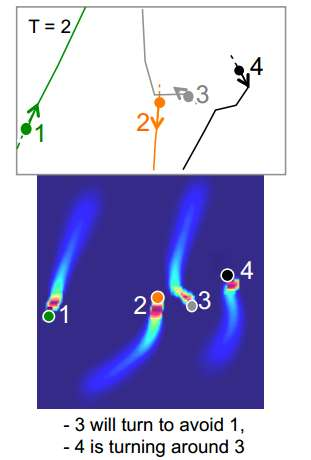
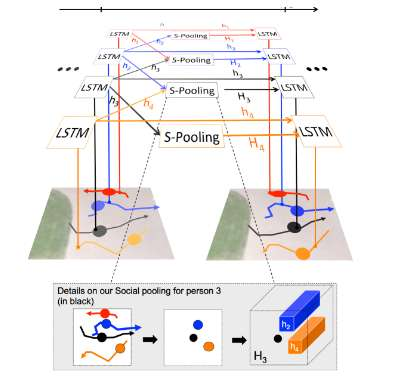
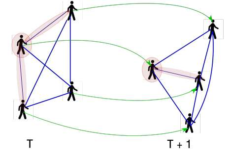

@title[Introduction]
## Let there be love
##### All ABOUTNumber of LOVE

---
@title[Theme Switcher]

## About Time
关于时间 

- "刘一雄，你还记得黄嘉琪这号人吗?" Begin at: 2017-11-25 16:21 |
-  "想你了，又不知道说什么" Time at: 2017-12-05 00:02|
- “我突然想说的是我想和你, 
  谈
  恋
  爱”  Time at: 2017-12-09 00:46|
- 设计智能安全系统。|
- 部署具有社会意识的机器人。| 
  - mapping |
  - localization |
  - navigation |

@fa[arrow-down]

+++

### 研究背景

理解和预测群体行为有大量的应用的优化和扩展

- 异常事件检测、交通流量估计、目标跟踪和行为预测。|
- 设计智能安全系统。|
- 部署具有社会意识的机器人。| 
   - mapping |
   - localization |
   - navigation |

+++

### 研究目标

@title[行人轨迹预测]

<b>多目标行人轨迹预测</b>

图片来自 [A.Aha et.al 的Social-LSTM论文](https://github.com/gitpitch/gitpitch/wiki/Image-Slides) .

+++

#### 目标

- 性能方面: 精确性  可扩展性 效率性。|
- 方案: 无需手工设定 及 完全由数据驱动。|
- 应用方面: 能适用各种场景特别是拥挤场景下的行人轨迹预测。|

+++

### 研究挑战

- 拥挤环境的密度复杂。|
- human-human interaction 复杂、人类常识及隐性原则建模具有挑战性。|
- 个人瞬时行为模式的多样性。|

+++

### 研究方案

- 拥挤环境下, human-human interaction以及activiti-motion的建模
- RNN(或者LSTM)及其变体的架构及实现原理及其优缺点分析
- 基于Social-LSTM + attention机制的轨迹预测架构实现(本文重点)
- ~~轨迹预测作用于具体应用~~

---

## 相关研究及现状

Human-human interaction |
行为检测 |
基于RNN的轨迹预测

@fa[arrow-down]

+++

### Human-human interactions

代表技术: 

- ”Social Force"力学模型|
- Discrete Choice framework | 
- well-enginerrd features |
-  **这些工作都是基于简单动力学模型，利用简单的距离和规则等hand-craft 特征来进行预测** |

+++

### 行为检测
代表技术:
- trajectory clustering |
- Inverse Reinforcement Learning |
- Scene semantic 以及 RNN |
-  **这些工作都局限于静态的环境信息进行有限的预测，而我们希望在动态环境下对行人轨迹进行动态实时地预测**|

+++

### RNN 序列预测任务
代表技术:

- LSTM(Long-shor Time Memory) |
  - 解决了rnn的梯度消失与梯度爆炸问题 |
- GRU(Gated Recurrent Unit) |
  - 相对于LSTM只用了两个gate，更少的梯度消失问题 |
-  **常规的RNN都是针对单独一个序列任务的，其他序列对于该网络是不可见的**|

---

@title[Social-LSTM]

## Social-LSTM原理及介绍
拥挤人群轨迹预测的RNN架构. |
详细介绍[Social-LSTM论文]http://cvgl.stanford.edu/papers/CVPR16_Social_LSTM.pdf) .

@fa[arrow-down]

+++

### Social-LSTM的架构

 

- **S-Pooling层**将在独立个体的LSTM间建立状态连接，能捕获**human-human的交互作用**。  
- 在任意场景中每个时间步骤的多个LSTM单元可以应用**反向传播算法，而保持“群体记忆”**。

+++
@title[Social-LSTM架构图]

Social-LSTM <b>架构</b>

图片来自 [A.Aha et.al 的Social-LSTM论文](http://cvgl.stanford.edu/papers/CVPR16_Social_LSTM.pdf) .

+++

#### 隐藏状态(Hidden State)

 

- Time $t$, for $i^{th}$ person  的**LSTM的隐藏层**状态表示为$h^t_i$ 。
- S-Pooling层使用一个所谓“Social hidden state tensor”的 **隐藏状态张量$H^i_t$** 共享邻居们的表示。
- 隐藏状态维度$D$, 邻居尺寸大小$N_o$ ，对应$i^{th}$ person 轨迹为一个 $N_o$  $\times$  $N_o$ $\times$  $D$  张量:

隐藏状态层$H^i_t$张量(1)

`$$
H^i_t(m, n, :) = \sum_{j \in N_i} {\bf 1}_{mn} [x^j_t - x^j_t , y^j_t - y^i_t] h^j_{t-1} （1）
$$`

+++

##### 网络结构满足的递归方程组

 隐藏状态张量 转化为嵌入向量与坐标时满足的方程组(2)

- 注意其中的参数$W_e, W_a, W_t$ 三个参数就是训练需要学习的权重向量。 

`\begin{align}
e^i_t = \phi(x^i_t, y^i_t; w_e) \\
a^t_i = \phi(H^i_t; W_a)；\\
h^t_i = LSTM(h^{t-1}_i, e^t_i, a^i_t; W_t)
\end{align}`

+++

### Social-LSTM位置预测
目标 |
模型选择 |
损失函数
 
@fa[arrow-down]

+++
##### 目标
$t$时刻的隐藏状态被用来预测轨迹坐标$(x, y)^i_{t+1}$ 在下一个时间步骤$t+1$时的轨迹位置分布。

+++
##### 模型选择
- 假设轨迹服从双变量正太分布,参数为如下：均值`\(\mu^i_{t+1}=(\mu_x,\mu_y)^i_{t+1}\)`,标准差`\(\sigma^i_{t+1}=(\sigma_x,\sigma_y)^i_{t+1}\)`, 互相关系数为`\(\rho^i_{t+1}\)`

轨迹预测概率分布(3)

- 轨迹概率分布满足:

`$$（\hat x, \hat y)^i_t ～ N(\mu^i_t, \sigma^i_t, \rho^i_t) （3）$$`

+++
##### 损失函数设计

最优化使用的损失函数(4)

`$$[\mu^i_t,\sigma^i_t,\rho^i_t] = W_ph^{t-1}_i$$`

`$$L^i(W_e,W_l,W_p) = -\sum_{t={T_{obs}+1}}^{T_{pred}} log({\bf p}(x^i_t, y^i_t|\sigma^i_t, \mu^i_t, \rho^i_t))$$`

+++

### Social-LSTM实现 

基于Pytorch平台的Social-LSTM实现(tensorflow也开源). |
详情 [Github源代码实现](https://github.com/vvanirudh/social-lstm-pytorch) .

@fa[arrow-down]

+++?code=src/python/model.py&lang=python&title=Model.py 

@[1,17-58](初始化模型，包括超参数, 各变量尺寸大小，继承自nn.Module.)
@[58-78](设计实现张量-也就是模型中的Social-Pooling layer层.)
@[79-149](forward函数实现，Pytorch默认设定用于预测和正向传播的更新.)

+++?code=src/python/train.py&lang=python&title=train.py 

@[1,7-73](用于训练的参数指定很初始化.)
@[75-100](训练的一些日志、数据集、目录设定.)
@[104-112](check point设定以及网络初始化.)
@[119-269](循环周期迭代优化，训练网络模型.)

---

## 论文方案

改进Social-LSTM |
引入Attention机制 |
模型扩展于具体应用 

@fa[arrow-down]

+++

### 改进Social-LSTM

- social-lstm的局限性|
- 改进方案|

+++

### 引入Attention机制

#### what is Attention?

@title[Social-Attention]

<b>Social-Attention 机制</b>

图片来自 [Anirudh Vemula Social-Attention...论文](https://arxiv.org/abs/1710.04689) .

+++

#### why? + How?

---

### ~~模型扩展于具体应用~~

- ~~选择数据集, 如:~~
- ~~具体情况~~
- ~~分析及验证模型预测的行为有效性~~

---

## 实验设计

数据集 |
性能指标 |
方案对比

@fa[arrow-down]

+++

### 数据集

- ETH 
- UCY
- soccer-games

+++

### 性能指标

- 平均位移误差 - 所有估计的轨迹点和真实点的均方差(MSE)。|
- 最终位移误差 - 在预测区间的末尾时刻$T_{pred}$ 预测的最终地点和真是的最终地点的距离。|
- 平均非线性误差 - 这是轨迹的非线性区域的均方差。因为大多数轨迹预测的误差发生在人与人之间的相互作用产生的非线性转变过程中，所以我们明确地评估这些区域的误差。|

+++

### 与其他方案对比

- Linear model(**Lin**) 线性模型
- Collision avoidance(LTA) 
- Social force(SF)
- Social LSTM
- ...........

---

## 后续工作

- 改进方案的实现
- Pytorch深度学习平台
- attention机制的引入
- 实验对比
- .........

---

@title[Ending]g

## 感谢

---
